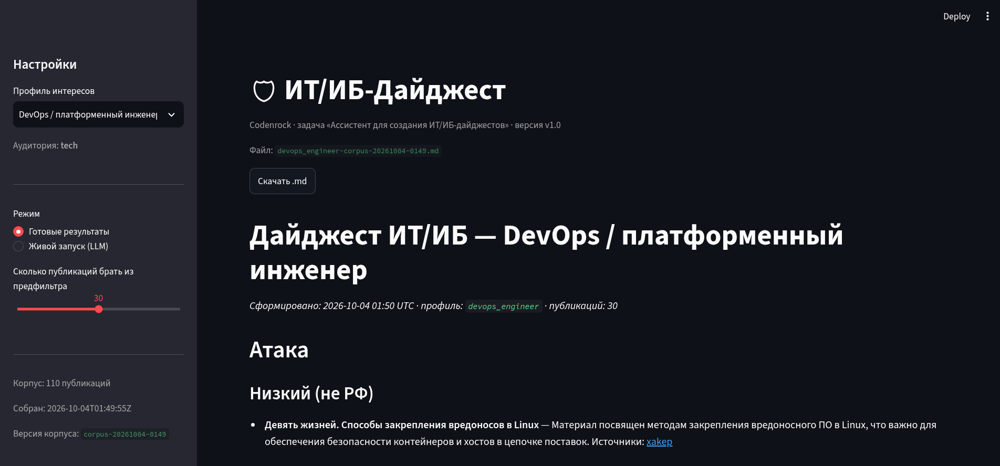
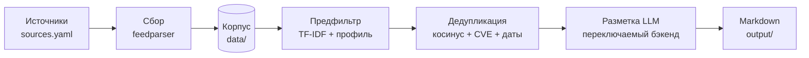

# ИТ/ИБ-Дайджест


[](https://www.python.org/)
[](https://streamlit.io/)
[](https://scikit-learn.org/)
[](https://www.anthropic.com/)
[](https://ollama.com/)
[](https://ai.google.dev/)
[](https://openrouter.ai/)
[](https://codenrock.com/)

ИИ-ассистент, который собирает публикации из новостных RSS-источников,
отбирает релевантные по профилю интересов читателя, группирует по темам
и формирует готовый дайджест в Markdown. Сделано для хакатона Codenrock
(задача «Ассистент для создания ИТ/ИБ-дайджестов»).

**🎬 [Видео-демонстрация](https://drive.google.com/file/d/1R9IpvVCoYZjWTjmRb1gsaKIUsEtAXpqY/view?usp=sharing)  ·  📑 [Презентация](https://drive.google.com/file/d/1-AbIgJLARBqQWl87jGv_lOhjnCuaBAYW/view?usp=sharing)**




## Содержание

- [Быстрый старт](#быстрый-старт)
- [Что делает](#что-делает)
- [Как устроен пайплайн](#как-устроен-пайплайн)
- [Установка](#установка)
- [LLM-бэкенд](#llm-бэкенд)
- [Запуск](#запуск)
- [Веб-сервис](#веб-сервис)
- [Примеры результатов](#примеры-результатов)
- [Структура проекта](#структура-проекта)
- [Ограничения](#ограничения)

## Быстрый старт

```bash
python -m venv .venv && source .venv/bin/activate   # Windows: .venv\Scripts\activate
pip install -r requirements.txt
cp .env.example .env                                 # указать LLM_BACKEND и ключ
python cli.py --profile profiles/soc_analyst.yaml    # -> output/<профиль>-<версия корпуса>.md
```

## Что делает

- собирает публикации из настраиваемого списка RSS-источников
  (`sources.yaml`), устойчиво к WAF-блокировкам отдельных сайтов
- отбирает релевантные по профилю интересов (`profiles/*.yaml`) —
  TF-IDF-предфильтр, без обращения к внешним API
- схлопывает дубли — одна и та же новость у нескольких источников
- размечает оставшиеся публикации через LLM: категория и вес-приоритет
  для технарей, теги и готовый текст для руководства — таксономия взята
  из материалов организаторов хакатона
- собирает результат в Markdown-файл дайджеста

Три готовых профиля:

| Профиль | Аудитория | Формат |
|---|---|---|
| `soc_analyst` | технарь | группировка по категории Атака / Уязвимость / Инфо, вес |
| `devops_engineer` | технарь | то же |
| `it_director_ciso` | менеджер | сжатая бизнес-подборка: готовый текст и теги на публикацию |

## Как устроен пайплайн



| Ступень | Модуль | Что делает |
|---|---|---|
| Сбор | `tools/fetch_corpus.py`, `tools/_http.py` | RSS через feedparser, запасные заголовки против WAF |
| Предфильтр | `pipeline/prefilter.py` | однословные keywords и tech_stack — в общем TF-IDF-пространстве, многословные — бонус за точное совпадение фразы |
| Дедупликация | `pipeline/dedup.py` | TF-IDF-косинус + защита по CVE + минимум общих слов + окно дат ±2 дня |
| Разметка | `pipeline/llm_stage.py` | батчами через переключаемый LLM-бэкенд |
| Рендер | `pipeline/render.py` | Markdown под аудиторию |

## Установка

```bash
python -m venv .venv
source .venv/bin/activate        # Windows: .venv\Scripts\activate
pip install -r requirements.txt
cp .env.example .env
```

## LLM-бэкенд

Переключается переменной `LLM_BACKEND` в `.env`, без правки кода:

| `LLM_BACKEND` | Что нужно в `.env` | Проверка |
|---|---|---|
| `claude` | `ANTHROPIC_API_KEY` | на образцах не запускался |
| `ollama` | локально: `ollama pull qwen3.6:35b-a3b` + `ollama serve` | на образцах не запускался |
| `gemini` | `GEMINI_API_KEY` + `GEMINI_MODEL` (образцы получены на `gemini-3.5-flash-lite`) | проверен на трёх профилях |
| `openrouter` | `OPENROUTER_API_KEY` + `OPENROUTER_MODEL` | на образцах не запускался |

Для `ollama` рекомендуется `export OLLAMA_CONTEXT_LENGTH=22000` перед
`ollama serve` — промпты батчами по умолчанию (10 публикаций) этого
просят.

## Запуск

```bash
# 1. проверить доступность источников (опционально, но полезно)
python tools/check_feeds.py

# 2. собрать корпус публикаций -> data/corpus-<версия>.json + data/corpus-latest.json
python tools/fetch_corpus.py --per-source 20

# 3. собрать дайджест по профилю -> output/<профиль>-<версия корпуса>.md
python cli.py --profile profiles/soc_analyst.yaml
python cli.py --profile profiles/devops_engineer.yaml
python cli.py --profile profiles/it_director_ciso.yaml
```

Полезные флаги `cli.py`:

| Флаг | Что делает | По умолчанию |
|---|---|---|
| `--top-n` | сколько публикаций брать из предфильтра | 30 |
| `--min-score` | порог релевантности (отсекает только нулевые совпадения) | 0.001 |
| `--batch-size` | публикаций на один вызов LLM | 10 |
| `--out` | свой путь для файла | `output/...` |

## Веб-сервис

`app.py` — тонкая обёртка (Streamlit) поверх того же пайплайна, два режима:

- **Готовые результаты** — читает файл из `output/`, мгновенно, без
  обращения к LLM. Сформируй заранее: `python cli.py --profile ...` для
  каждого профиля.
- **Живой запуск** — прогоняет пайплайн по кнопке прямо в браузере,
  показывает демо-метрики (сколько публикаций, предфильтр, дедуп,
  LLM-бэкенд). Ограничен rate-limit'ом: по умолчанию 5 запусков за 10
  минут (переменные `LIVE_RUN_LIMIT`, `LIVE_RUN_WINDOW_MIN` в `.env`) —
  сервис будет на публичной ссылке, лимит защищает чужой API-бюджет от
  случайного трафика.

Запуск:

```bash
streamlit run app.py
```

Публичная ссылка (своя машина, без managed-хостинга):

```bash
ngrok http --domain=bernetta-carpological-jessie.ngrok-free.dev 8501
```

## Примеры результатов

Готовые дайджесты лежат в `output/`: по одному на профиль, собраны на
одном корпусе (119 публикаций, 7 из 9 источников рабочие).

docs/img/digest-sample.png

## Структура проекта

```
digest/
├── README.md              этот файл
├── HANDOFF.md             что реализовано, цифры, ограничения (для передачи)
├── requirements.txt
├── .env.example
├── sources.yaml           список источников (RSS)
├── corpus.schema.json     схема корпуса публикаций
├── cli.py                 точка входа: весь пайплайн одной командой
├── app.py                 веб-интерфейс (Streamlit)
├── docs/                  презентация и изображения для README
├── profiles/              профили интересов (YAML)
│   ├── soc_analyst.yaml
│   ├── devops_engineer.yaml
│   └── it_director_ciso.yaml
├── pipeline/
│   ├── prefilter.py       TF-IDF-отбор по профилю
│   ├── dedup.py           дедупликация по событию
│   ├── llm_stage.py       разметка через LLM (переключаемый бэкенд)
│   └── render.py          рендер в Markdown
├── tools/
│   ├── _http.py           общий HTTP-хелпер (обход WAF-блокировок)
│   ├── check_feeds.py     проверка доступности источников
│   └── fetch_corpus.py    сбор корпуса публикаций
├── data/                  корпус публикаций (генерируется)
└── output/                готовые дайджесты (генерируется)
```

## Ограничения

Подробнее — в `HANDOFF.md`. Главное:

- нет живого сбора из Telegram: категория «Инфо» — общая для некритичных новостей
- нет полного извлечения структурных полей организаторов (группировка, страна жертвы, CVSS-вектор, IOC) — только категория, вес и объяснение
- нет месячной выжимки для менеджера: тот же список в другом формате
- дедупликация: защита по CVE работает только для публикаций про уязвимости
- `securitylab.ru` (HTTP 401) и `cisoclub.ru` (HTTP 403) недоступны
- добавление источника по URL «на лету» и автономный поиск источников не реализованы
- LLM-разметка недетерминирована между прогонами
- сервис живёт на личной машине через ngrok
- экспорт только в Markdown, DOCX нет
